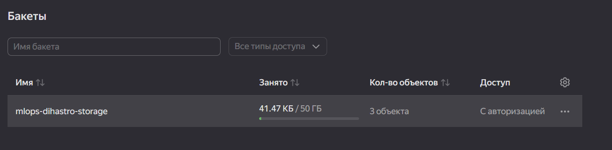
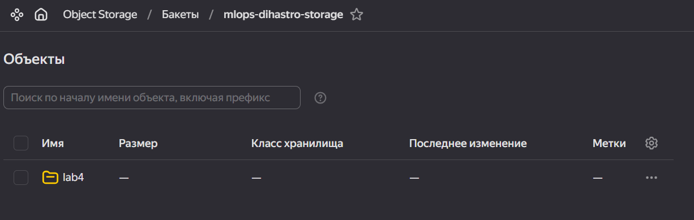
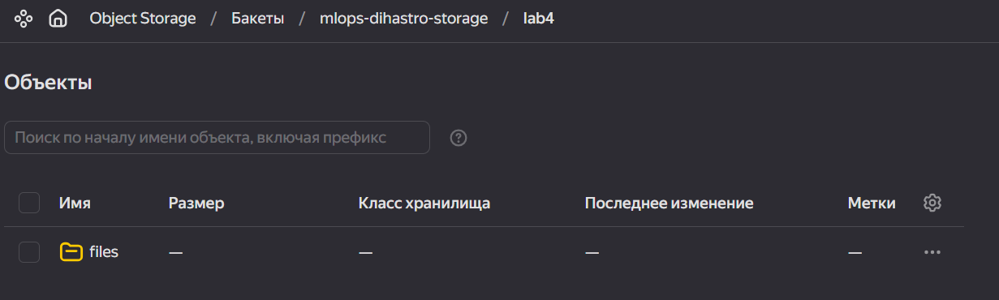
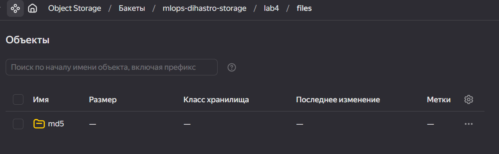
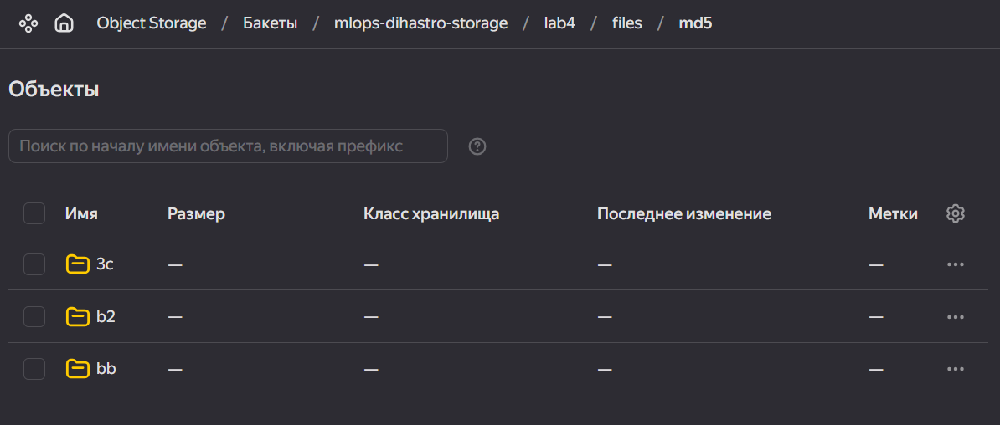
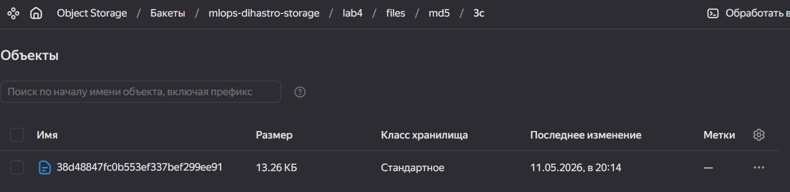

в этом каталоге выполняется 4 задание по версионированию наборов данных

---

Что проделано:

- Создан бакет в Яндекс s3
- Далее выполнены следующие команды

```
dvc init  # из корня репозитория

dvc remote add -d yandex-s3 s3://mlops-dihastro-storage/lab4
dvc remote modify yandex-s3 endpointurl https://storage.yandexcloud.net

dvc remote modify --local yandex-s3 access_key_id "ACCESS_KEY_ID"
dvc remote modify --local yandex-s3 secret_access_key "SECRET_ACCESS_KEY"

git add .dvc/config .dvc/.gitignore
git commit -m "..."  # Коммитим публичную конфигурацию
```

- В соответствующих питоновских файлах 3 раза подготовили датасет, и закоммитили как в гит, так и в dvc
Флоу был на каждом шаге таким:

```
# Создали датасет/провели изменения в нём (написали и запустили скрипт)
dvc add titanic.csv
git add titanic.csv.dvc .gitignore  # В первый раз titanic.csv убрал из .gitignore
git commit -m "feat lab4: ..."
dvc push
```

Далее, чтобы переключиться между каждой версией переключаемся на соответствующий коммит в гите и подтягиваем
посредством titanic.csv.dvc соответствующую версию датасета. Ниже приведены исполнения команд и первые строки titanic.csv

1. Конечный результат (самое последнее изменение)

```
head titanic.csv

# Pclass,Age,Sex_female,Sex_male
# 3,22.0,False,True
# 1,38.0,True,False
# 3,26.0,True,False
# 1,35.0,True,False
# 3,35.0,False,True
# 3,29.69911764705882,False,True
# 1,54.0,False,True
# 3,2.0,False,True
# 3,27.0,True,False
```

2. Переключаемся на вторую версию (где мы заполнили все NaN средними значениями)

```
git checkout c3534a7
# M       lab4/readme
# Previous HEAD position was 62362a8 feat lab4: push other files in lab4 dir
# HEAD is now at c3534a7 feat lab4: make dataset v2

dvc checkout
# Building workspace index                                                                                                     |2.00 [00:00,  389entry/s]
# Comparing indexes                                                                                                           |3.00 [00:00, 2.07kentry/s]
# Applying changes                                                                                                             |1.00 [00:00,  32.3file/s]
# M       titanic.csv

head titanic.csv
# Pclass,Sex,Age
# 3,male,22.0
# 1,female,38.0
# 3,female,26.0
# 1,female,35.0
# 3,male,35.0
# 3,male,29.69911764705882
# 1,male,54.0
# 3,male,2.0
# 3,female,27.0
```

3. Переключаемся на самую первую версию датасета - неизменённую:

```
git checkout b4befe6
# M       lab4/readme
# Previous HEAD position was c3534a7 feat lab4: make dataset v2
# HEAD is now at b4befe6 feat lab4: init dataset v1

dvc checkout
# Building workspace index                                                                                                     |2.00 [00:00,  166entry/s]
# Comparing indexes                                                                                                           |3.00 [00:00, 2.24kentry/s]
# Applying changes                                                                                                             |1.00 [00:00,  29.9file/s]
# M       titanic.csv

head titanic.csv
# Pclass,Sex,Age
# 3,male,22.0
# 1,female,38.0
# 3,female,26.0
# 1,female,35.0
# 3,male,35.0
# 3,male,
# 1,male,54.0
# 3,male,2.0
# 3,female,27.0
```

---

Ниже прикреплён скрин состояния по итогу работы Яндекс s3:







Ниже приведён пример содержания директорий из списка на картинке выше:


